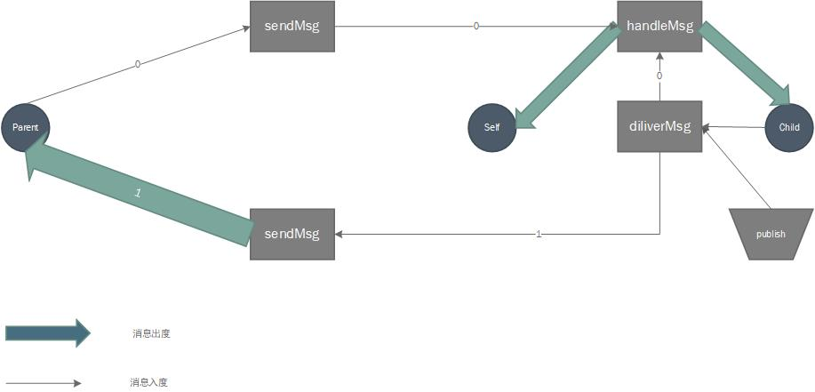
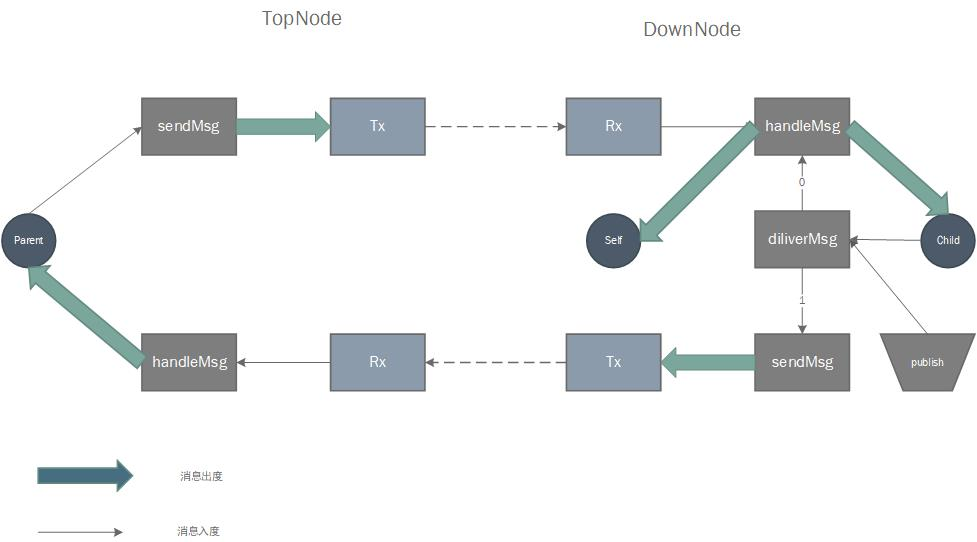

# FCP
FCP(Functinal communication protocol),TCP面向的程序之间的连接，而FCP面向的是功能(函数)。
FCP以发布订阅机制为核心，建立多进程、跨平台的树状网络。

FCP aim to create a convenient way to transport data between devices.

## principle
1. AloneNode 独立节点

2. PairNode 连接节点

每个节点都可以独立工作，转发或处理收到的消息。因此每一个节点（除了Master)都有一个父节点（gateway）和若干个子节点（child）。
AloneNode 可以在一个进程中组成通讯网络。而PairNode需要实现Tx和连接操作可以在不同进程间组成网络。

## 路径系统
当多个节点组成网络时，每一个节点的路径是唯一的。节点的命名规则符合以下正则表达式。  
当需要访问节点时，将给出一个URI。URI可以访问一个或多个节点，也能指定不访问某些节点。  

1. node_name :: [a-z]\\w*:\\d+(\\|\\d+)*
2. uri_name  :: [a-z]\\w*(:\\d+(\\|\\d+)*)?(!\\d+(\\|\\d+)*)?
3. node_path :: (/node_name)+|/
4. uri_path  :: (/uri_name)+|/

URI的3种用法：
- 广播：node_name
- 单播\多播: node_name:num1|num2
- 排除： node_name!num1|num2

